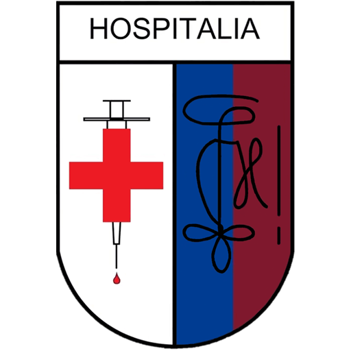

<!-- AUTO-GENERATED-CONTENT:START (STARTER) -->
<p align="center">
  <a href="https://www.gatsbyjs.org">
    
  </a>
</p>
<h1 align="center">
  Hospitalia Gent
</h1>

Welcome to Hospitalia's website! This site is built using GatsbyJS.

## Quick start

1. **Install the Gatsby CLI**

    ```shell
    npm install -g gatsby-cli
    ```

2.  **Clone the repository**

    ```shell
    git clone https://github.com/Hospitalia/hospitalia.gent.git
    ```

3.  **Start developing.**

    Navigate into the site’s directory and start it up.

    ```shell
    cd hospi
    gatsby develop
    ```

4.  **Open the source code and start editing!**

    The site is now running at `http://localhost:8000`!

    _Note: You'll also see a second link: _`http://localhost:8000/___graphql`_. This is a tool you can use to experiment with querying your data. Learn more about using this tool in the [Gatsby tutorial](https://www.gatsbyjs.org/tutorial/part-five/#introducing-graphiql)._


## Contact

Any questions or remarks regarding this website or repository may be directed at [web@hospitalia.gent](mailto:web@hospitalia.gent)